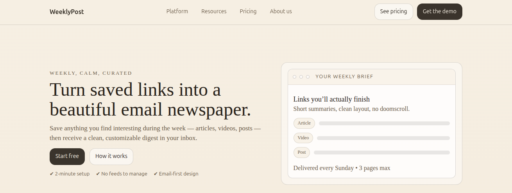
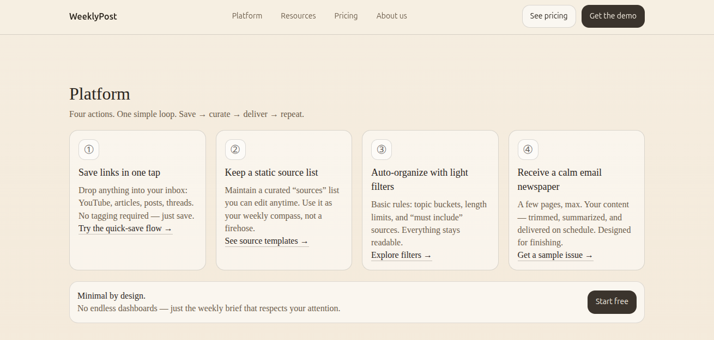
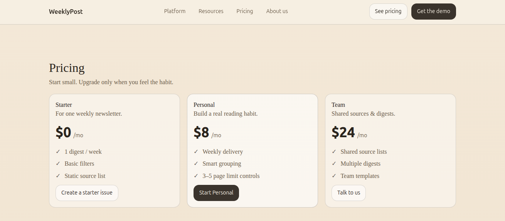
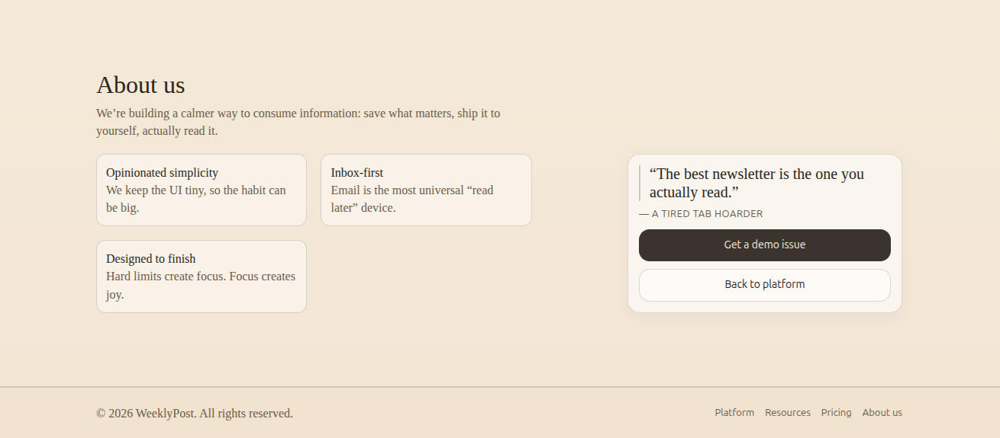

# WeeklyPost — Email Newspaper

A serene, minimalist landing page for **WeeklyPost**, a service that transforms your saved links, articles, videos, and posts into a calm, curated email digest delivered every week.

## 🎯 About

WeeklyPost solves the problem of information overload by offering a simple workflow:

- **Save** anything interesting during the week (articles, videos, posts, threads)
- **Curate** using static source lists and light filtering rules
- **Deliver** a clean, customizable 2–3 page email newspaper every Sunday
- **Repeat** the cycle with a sustainable reading habit

No feeds to manage. No doomscroll. Just quality content delivered to your inbox.

---

## 📸 Screenshots

### Hero Section

### Platform Workflow

### Pricing Plans

### Reviews

---

## 🚀 Live Demo

Check out the live version here: **[WeeklyPost Live Demo](https://weeklypost.live)**

---

## 🎨 Design Highlights

- **Color Palette**: Warm sepia tones with dark ink
- **Typography**: Serif headlines for editorial feel + system fonts for UI
- **Layout**: CSS Grid for responsive multi-column sections
- **Micro-interactions**: Hover states on buttons and navigation links
- **Accessibility**: Skip links, semantic HTML, ARIA labels
